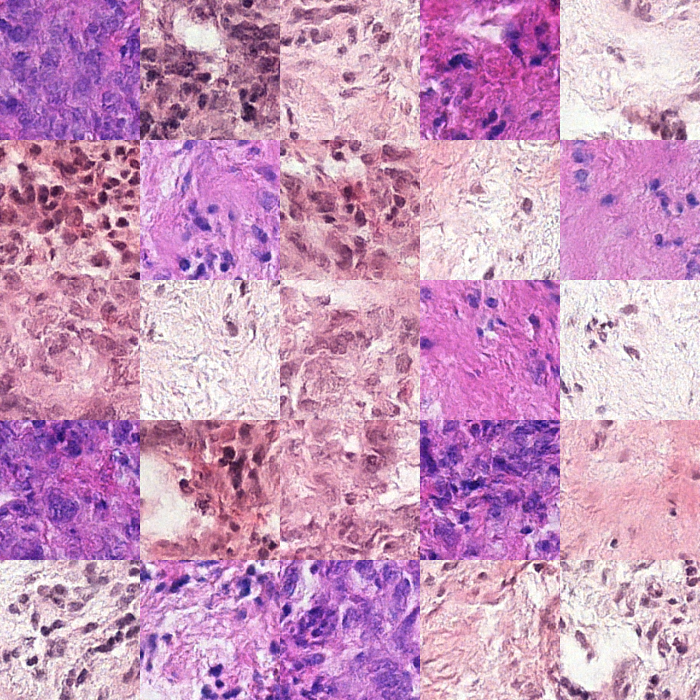
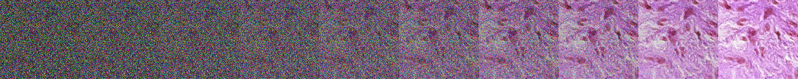

# Histology generation

This is a repository containing code for generating histology images



## Installing

1. Install uv package manager: ```pip install uv```
2. Install dependencies: ```uv sync```

## Usage

To generate images to the *"samples"* folder: ```uv run generate.py <N images> <device> <batch size>```

By default device is *cuda:0*, batch size is 16 (should be enough for a 16gb GPU)

To generate a image grid: ```uv run generate_grid.py <N images>```, it expects *N images* to be a square of some number


To see the process of denoising the image run: ```uv run generate_show_steps.py <NUM_STEPS>```


